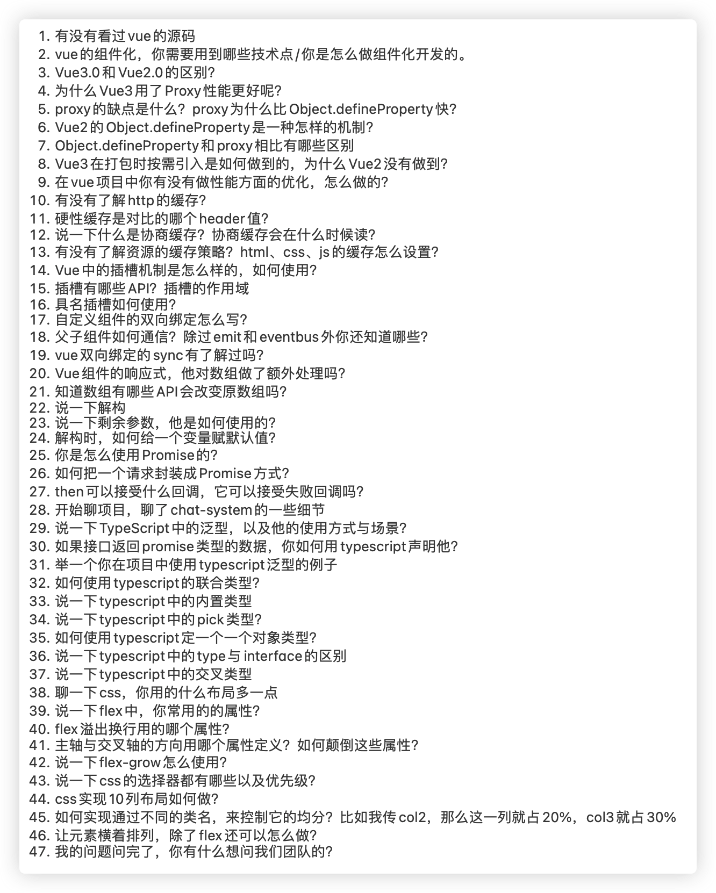

# 神奇的程序员-面6终上岸

### 首先给个个人评价

- 首先遇到这种环境肯定是很伤感的，一大堆麻烦事，但是他能意识到环境的变化，并作出改变，实际上已经跑赢你一部分人了，给自己带来更多机会

- 当然，很遗憾的是他曾经不努力只有大专学历，让我想到自己曾经的不够努力，实在是让人很伤感，在这个这么内卷的时代，不够努力的人，这苦果够吃一辈子

- 当然，他很幸运，因为他懂得努力，技术上的努力虽然让他够不着大厂，但是还是有很多小厂的机会，这个时代还是有很多机会的，就是越小的公司坑越多，到了这个年龄，我们越来越追求良好的环境，他也找到了一个合适的，这是他努力的成功，祝福他

> 不过最后想说，我们很多人处于一个不是很良好的环境，我们经常不懂得培养良好的习惯，良好的技术习惯，良好的思维习惯，良好的能力系统，这是或许我们和那些人最大的差距吧，可惜这种差距是最难解决的，只是，如果没有这种意识，那永远也没有解决的可能，希望我们每个人都能懂得，都能寻找到一些

### 面试题学习

###### vue源码

- 简单看过一些源码，也看过一些相关的教学视频，对Vue的初始化到构建挂载等一些回调逻辑，但是并没有深入细节

- 也就是没有专门研究

###### vue的组件化，用到哪些技术点，平时是怎么组件化开发的

- 关于组件化的思考，我一般对通用模块都会考虑抽离出一些组件

- 平时主要分为业务组件和功能组件，比例都差不多吧

- 例如功能组件，会抽离全局的分页组件、table组件，这些都是业务上常用的一些组件，这些功能组件抽离主要是规范项目一致性，也方便维护。功能组件一般考虑多个功能模块使用时抽离的通用组件，例如表单这类，例如列表这类，例如一些echart图，例如一些选择树组件，多数都有实现过

- 业务组件一本是抽离复杂页面的一个块，蕴含独立的业务逻辑，他们也是单文件组件，也可以独立存在，或者依赖输入参数，当然，作为子组件，一般都是有props进行参数传递的

- 至于组件抽离的实际，一般要根据业务场景，过于小的项目，例如echart图，可能就用到一两个地方，无所谓抽离，例如表单列表分页这类常用则一般都会抽离，当然，很多时候是直接拿以前的进行细微改造

- 关于组件化的技术，浅层组件交互常用`props`和`$emit`，然后之前还有用过`eventBus`、`$emit/$on`中间车间多兄弟组件通讯 ，至于组件库式的传递听说`provide/inject`进行隔代深层次的组件传递，简单用过，但是并没有深度实践

- 平时基本上就是简单是父组件参数传递和接受子组件的通知回调

- 至于`parent/children`等其余通信方法比较少用

> 还有那些呢？

1. 插槽

	- 预留位置

	- 使用插槽可以减少组件依赖，例如不用状态控制，进一步解耦的组件化方式

	- 例如使用作用域插槽可以轻易取得子组件数据使用

###### Vue3.0和Vue2.0的区别

- 语法的改变，使用了类式语法，使用了typescript，暴露createApp方法进行Vue实例化

- 改为使用`proxy`进行响应式处理，解决了`Object.definedProperty`带来的对象数组等无法良好监听响应的问题

- 主要是这两方面，当然，还有使用setup等这些东西，以及虚拟DOM算法优化，自定义渲染器等等，这些就不熟了

- 这里细点：[深圳市洲明科技股份有限公司](知识笔记/大前端/面试/面试经验之道/深圳市洲明科技股份有限公司.md)

###### 为什么Vue3.0使用proxy性能更好呢？

- proxy是es6的语法，具有更强大的功能，是直接拦截对象，而不是拦截属性，并且提供很多拦截方法，直接解决了2.0存在的对象处理问题，提高了性能

- 当然也是有负面作用的，兼容性相比es5的`Object.definedProperty`差，但是这个技术将持续被厂家兼容，不断的进行性能优化

###### proxy的缺点是什么？为什么比`Object.definedProperty`快

- 缺点主要是兼容性的问题，使用es6的语法，对一些环境的兼容性可能存在问题，也就是对兼容性比较强的需求的项目可能不太方便使用这个技术，或需要特殊转码解决，对很多企业并不是多么好的选择，暂时

- 快的原因是，解决了原本`Object.definedProperty`的问题，原本`Object.definedProperty`监听属性而无法直接监听对象内部变化，需要对对象内部进行复杂监听处理，例如数组需要重新创建来触发监听，虽然提供了`$set/$delete`语法处理，但是实际上也是消耗性能的，而proxy则是原生支持直接监听对象的变更

###### `Object.definedProperty`是什么样的机制

- 首先`Object.definedProperty`可以直接在一个对象上操作这个存在亦有的对象或熟悉，增删查改，或设置对象/属性的属性，例如设置内部属性不可改(默认就是不可改的)，可以通过`get()/set()`方法操作

- 那么Vue就是通过这个方式实现对数据的监听回调，也就是双向绑定

- 当然，这里面操作的是一个个属性，也就是箭头的是一个个属性，如果想要监听一个对象，这个就做不到了，所以对这种情况Vue就需要另作处理了，例如递归出来，通过hasOwnProperty识别所有对象，然后对所有对象都判断处理一遍

- 那么很明显这就比较消耗性能了

###### Object.definedProperty与proxy有那些区别

- 前者是监听一个个属性，而后者直接拦截对象，区别很大

###### vue3打包按需引入如何做到，为什么vue2没有做到

Tree-Shaking实现内部组件ES导出，这样内置组件实现按需引入

> [快速了解vue3.0新特性](https://www.bilibili.com/read/cv6429077)

###### 你在vue项目做了哪些性能优化

1. 打包优化。拆分文件、代码压缩、gzip压缩、抽离公共插件

2. CDN加速。将部分静态资源使用CDN引入

3. 路由按需加载

4. 页面资源按需加载现实，图片懒加载

5. 浏览器缓存

6. 大数据量的分页和查询

7. v-if和v-show的使用

> [手把手教你深入Vue3.0(Vue-cli4)项目打包性能优化实践](https://blog.csdn.net/qq_36824777/article/details/106407846)

> [Vue 项目性能优化 — 实践指南（网上最全 / 详细）](https://zhuanlan.zhihu.com/p/78467131)

###### 有没有了解http缓存

- 知道可以进行资源是否缓存设置，`cache-control`，可以设置不缓存、缓存、缓存时间等

- 尤其是项目token设置的时候，可能需要设置缓存时间`Expires`

- 也有你协商缓存和硬性缓存这两个概念

- 时常在Vue项目中，会根据需要缓存的路由页面设置缓存，`keep-active`

- 这方面有了解，但是业务应用得少，就没有深入了，实际上是忘了

###### 硬性缓存对应的是那个header值

	只要缓存有效，就直接读取缓存数据

1. expires

2. cache-control

###### 说下协商缓存，协商缓存会在什么时候取得

- 协商缓存是由服务器确认资源是否可用，也就是浏览器会拿资源的请求头去找服务器验证有效性，无效则重新获取

- 这里面主要是判断`Last-Modified`或者`Etag`，如果服务器返回304则浏览器会直接读取缓存

> `Etag`是`HTTP1.1`为解决前者出现的一些问题来更精准的控制缓存

###### 有哪些资源的缓存策略，html、css、js是怎么设置缓存

- 对不常变的资源可以手动修改版本/后缀实现资源更新

- 而对其余的资源也是后缀变更实现，不过一般工程化项目会直接使用hash作为后缀，实现项目更新，如果某种资源固定没有变化，hash值也就不会变化，这个可以通过配置webpack插件打包处理

- 当然也可以使用http缓存实现，也就是对某些资源使用强缓存，需要变更的时候手动修改路径或后缀版本参数

- 而协商缓存是常见设置，或直接设置不缓存也是可以的

###### Vue的插槽机制是怎么样的？如何使用？

- 相当于留一个位置，直接将Vue模板传进去，比起传参可以实现更加灵活的操作，也是一种灵活的组件思想，并且可以实现默认值替换功能

- 并且相当于一小块组件，由于是在父组件中使用，可以自由变量控制而不需要复杂的传参，也就是这个子组件将变数大的组件块用插槽填充，这样就不需要限定各自格式和传参接口，非常灵活

- 例如一个布局灵活多样的列表组件，将允许自定义的行使用插槽暴露，并且使用默认值，这样就允许默认使用标准化的列表，也可以让用户自定义使用，通过插槽语法，使用时替换默认插槽模板代码，就这么简单

###### 插槽有哪些API？插槽的作用域

- 最简单是插槽直接使用slot标签实现，这是默认插槽

- 具名插槽是在一个组件有多个插槽的时候通过添加attribute属性name作为区分

- 作用域插槽。因为插槽实际上是将模板传到到子组件一起渲染，那么这个时候需要使用到父组件的变量的话就需要通过v-bind将参数注入进入，也就是相当于插槽的prop绑定上去，默认命名是`slotProps`。

> 作用域插槽的内部工作原理是将插槽内容包裹在一个拥有单个参数(slotProps)的函数里

###### 具名插槽如何使用？

- 子组件通过在元素上添加slot属性标明这是具名插槽，不加的则是默认插槽，然后父组件通过在slot插槽标签中name区分，对应不同名字的插槽

###### 自定义组件的双向绑定怎么写？

- 如input组件的双向绑定是对父组件emit进行通知，也就是通过prop和$emit这种通信回调可以实现双向绑定。如input change回调修改$emit通知父组件，然后触发父组件修改

###### 父子组件如何通信，除了emit和evenBus外还有哪些？

- 主要用的就是emit和evenBus进行简单通信，听说常用于组件库开发无限传递通信的provide/inject，当然还有children和parent父子通信以及attrs/listeners隔代通信等

- 全局通信实际上还有用过Vuex，加个监听

###### Vue双向绑定的sync有了解过？

- 这是一个vue v-bind的修饰符，也就是一种语法糖，是实现组件和外部数据的直接双向绑定

- 以前我们是使用emit实现通知父组件更新的，例如emit/on，也可以使用update这个修饰符，而现在直接可以使用sync这个修饰符达到同样的效果，而不需要emit，相当于update的语法糖，又方便了，直接实现父子组件双向绑定

###### Vue响应式对数组做了什么额外处理？

- 如果直接通过下标修改数组，Vue是无法监听到的，而通过数组原生函数修改是可以监听到的，Vue重写了数组原生函数，加了notify分发通知，实现变更监听，如果splice这个函数就做了触发分发的操作

- 还有提供了$set语法支持对数组的操作，这个$set也支持对对象的修改，实际上是一个逻辑

###### 知道数组哪些API会改变原函数？

1. pop：弹出一个元素，也就删掉一节，直接修改原数组长度

2. push：添加一个元素，也就加上了一节，直接修改原数组长度

3. splice：添加或删除数组部分，返回被删除的部分，直接操作数组长度

4. shift：删除头部元素并返回，直接修改原数组长度

5. unshift：插入元素到头部。返回新数组长度，直接修改原数组长度

6. sort：排序，会改变原数组内容

7. reverse：翻转，直接修改原数组内容

8. fill：填充数组，批量覆盖或初始化数组，直接改变原数组内容

9. copyWithin：ES6新增的数组函数，直接指定位置插入一段数组，可覆盖原来数组部分，即改变长度，也改变内容

###### 说说对解构的理解

- 首先常用的是接受对象数据的时候我们可以通过结构函数，将一个对象展开，甚至深层次展开，并明确声明赋值部分对象内部变量，包括import在引入一些文件的多个函数对象的时候也一般会用

- 同时这个结合三点展开一个对象，将一个对象浅拷贝到另一个对象，这里的对象包括大括号的对象，也还有数组，字符串实际上也被支持

- 解构，如同字面上就是解析，就是拆解，将一个对象拆解成多个属性，这个同时也可以自动转为符合的类型，例如对象转为数组，自动将内容push到数组中，这就是语法糖了，其次一一对应，这种支持让声明赋值更加精准明确，也要求传入的参数应该有这个字段，有一定的明确声明意义，当然用起来最重要是方便

###### 说一说剩余参数，它是如何使用的

> 参考：[我离职了](https://juejin.cn/post/6956728664562073630)
