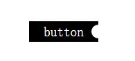

# 网上真实面试题

## CVTE面试

#### 一面

1. JS有哪些手段可以实现继承？

	可以直接复制创建一个新对象，实现继承
	可以使用原型浅拷贝继承和深拷贝继承

**参考答案**

	使用构造函数继承实现
	使用原型继承实现
	使用构造函数 + 原型继承实现

2. 说说JS的闭包？

	js的闭包是在函数调用中返回函数，返回的函数引用了调用函数的变量，并且使得外部可以使用该内部引用，使得调用完函数却因为仍然被占用而无法被释放，当然闭包的用处是创建一个封闭的函数作用域，保护私有变量，避免了外部对该函数的干扰
	比较大的问题是闭包会一直占用空间不释放（内存泄漏：跳转页面后还会存在），如果写太多闭包会影响性能

> 所以使用完闭包后要附空值回收内存

**闭包使用场景**

	实现函数回调
	实现一个方法操作一个对象
	模拟私有方法
	实现对数据的隐藏和封装

> [参考](https://juejin.im/entry/58f424d5570c3500563d7541)

3. 用纯JS实现，点击一个列表时，输出对应的索引（不能用JQuery哦）

**let解决**

```html
<div>
	<ul>
		<li>test1</li>
		<li>test2</li>
		<li>test3</li>
		<li>test4</li>
		<li>test5</li>
		<li>test6</li>
		<li>test7</li>
		<li>test8</li>
		<li>test9</li>
		<li>test10</li>
	</ul>
</div>
```
```js
var lis = document.querySelectorAll('ul li');
for(let i = 0, len = lis.length; i < len; i++) {
	lis[i].addEventListener('click', function() {
		console.log(i);
	}, false);
}
```

> 这个是最简单的，使用let(这是ES6语法)，因为每次循环都会创建一个新的let所以每次放大的i是正确的

**立即执行函数，直接中断闭包**

```js
var lis = document.querySelectorAll('ul li');
for(var i = 0, len = lis.length; i < len; i++) {
	(function(i) {
		lis[i].addEventListener('click', function() {
			console.log(i);
		}, false);
	})
}
```

> 这个稍微比较拗口，写个立即执行函数，在每个运行的li元素中都绑定一个立即执行事件，事件执行一次后中止闭包

**事件委托**

```js
var ul = document.querySelector('ul');
var lis = document.querySelectorAll('ul li');
ul.addEventLinstener('click', function(e) {
	var target = e.target;
	if(target.nodeName.toLowerCase() === 'li') {
		console.log([].indexOf.call(lis, target));
	}
}, false);
```

> 使用事件冒泡机制，在父元素(这里是ul)放个监听事件，通过判断点击的是那个li来执行不同的行为，这就是使用父元素进行事件代理，或说事件委托

4. CSS实现矩形按钮右边缘的中间有个往里凹的小半圆，如图：



**css实现**

	大概实现便是生成一个按钮和一个圆，然后将圆的一般覆盖在按钮的上面

```html
<!DOCTYPE html>
<html>
<head>
<title>button</title>
<meta charset="utf-8" lang="gb23123">
<style type="text/css">
	.btn{
	width: 100px;
	height: 30px;
	color: #FFF;
	font-size: 1.2em;
	text-align: center;
	line-height: 30px;
	background-color: black;
	top:50%;
	left: 50%;
	margin-top: -15px;
	margin-left: -50px;
	position: absolute;
	}
	.btn::after{
	width: 20px;
	height: 20px;
	content: "";
	right: -10px;
	top: 5px;
	position: absolute;
	display: block;
	background: #FFF;
	border-radius: 20px;
	}
</style>
</head>
<body>
	<button class="btn">button</button>
</body>
</html>
```

5. 为什么用vue而不用NG或者React？

	小巧、轻便、成本低。。。

**不使用NG**

	NG1脏检查性能太低，而且相对过时
	NG2不够成熟

**不使用React**

	JSX语法

**使用Vue**

	轻量级
	支持jade模版

**Vue的问题**

	相对react不太适合做大项目

> 注：貌似就Vue中文文档比较全。[Vue与其他框架对比](知识笔记/大前端/面试题/基础面试题/Vue基础面试题.md)
