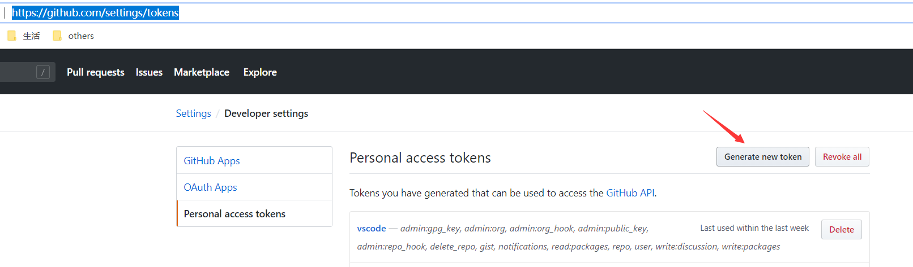
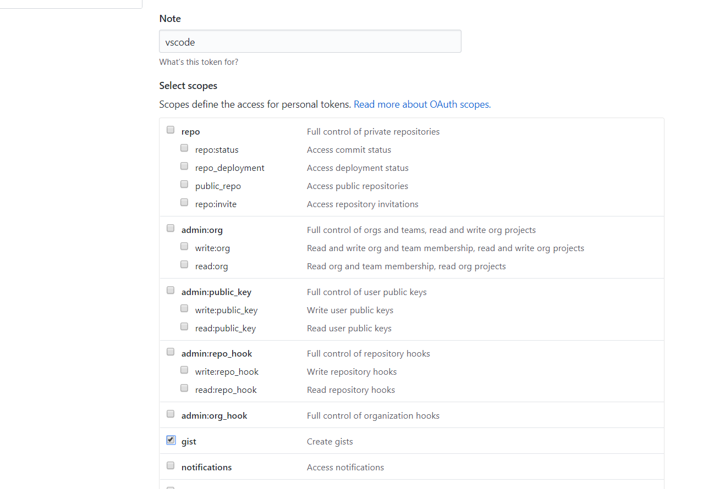
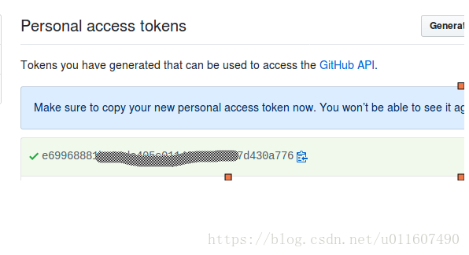
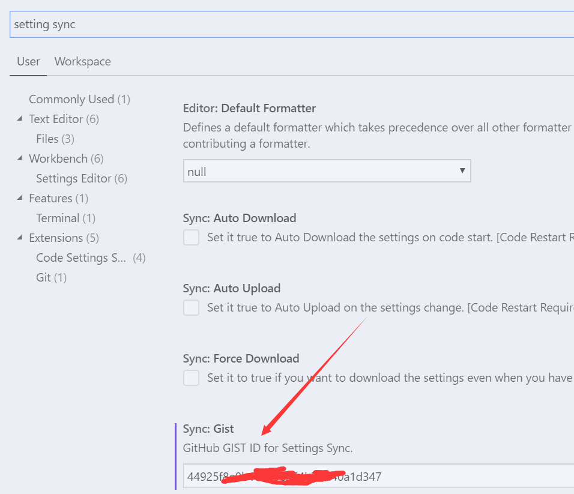

# vscode插件

## 同步管理vscode插件

#### 插件 Settings Sync

	这个解决vscode配置和插件多台设备同步的插件，上传到github同步管理

###### 获取github上的gist id

	Settings Sync同步管理配置是上传到github进行管理，我们通过获取github的gist id，赋予Settings Sync插件上传下载权限

> [获取github上的gist id](https://github.com/settings/tokens)

1. 找到对应位置，一般第一次创建一个token

2. 然后输入当前token名(我是用作vscode配置同步的，所以就叫vscode)和权限(gist)，然后点击确认创建

3. 然后复制创建的有gist权限的token

###### 安装配置Settings Sync

1. vscode插件商店Extensions(Ctrl+Shift+X)搜索Settings Sync插件，点击下载

	Upload Key : Shift + Alt + U
	Download Key : Shift + Alt + D

2. 按快捷键上传配置Shift + Alt + U，会弹出让输入gist id或token，将你github的token粘贴进去，回车

	这个时候第一次正常是成功的，然后右下角会弹出一个框告诉我们成功了，这个时候会有一个gist id（GIST ID : 44925f****a1d347），相当于这个插件的签名ID，我们在其他设备使用这个ID就能同步这些配置

> `强调`：将这个GIST ID保存起来，以后要在其他vscode中同步这些配置需要用到这个ID作为token

###### 其他设备同步配置

1. 安装Settings Sync插件

2. 按快捷键上传配置Shift + Alt + D，会弹出让输入gist id或token，将我们之前获取到的GIST ID粘上去，这个时候就可以同步了

	同样的，这台电脑的vscode也可以上传配置让之前那台vscode获取

###### 如果第一次操作失败，之后一直报gist id或token过期

1. 删除vscode的GitHub gist

2. 找到C:\Users\16343\AppData\Roaming\Code\User\syncLocalSettings.json的token值，删了

> 这个时候我们就相当于没有配置Settings Sync，可以重新来一遍

## 美化插件

1. vscode-icons

	给vscode文件加图标

## 便捷插件

1. Visual Studio IntelliCode

	高亮提示

2. View In Browser

	文件右键在浏览器打开，常用于html显示

3. Auto Close Tag

	自动添加结束标签
4. Auto Rename Tag

	同步更改开始与结束标签重命名

5. Code Runner

	选中代码运行

6. Code Spell Checker

	英文拼写检查

## 支持工具

1. Vetur

	支持vue语法

2. Npm Intellisense

	npm语法支持

3. HTML CSS Support

	支持HTML和CSS语法

## 提示工具

1. Import Cost

	导包大小提示

2. Path Intellisense

	路径提示

3. Git Lens

	git最新记录提示：作者、时间、commit备注

## 已添加插件

1. Angular2 v0.4.1

2. auto-close-tag v0.5.6

3. auto-rename-tag v0.0.15

4. beautify v1.5.0

5. code-settings-sync v3.2.9

6. es7-react-js-snippets v2.3.0

7. eva-theme v0.7.6

8. evermonkey v2.4.5

9. githistory v0.4.6

10. gitlens v9.8.0

11. java v0.45.0

12. JavaScriptSnippets v1.7.2

13. korofileheader v3.7.0

14. markdown-preview-enhanced v0.3.13

15. npm-intellisense v1.3.0

16. path-intellisense v1.4.2

17. ReactSnippets v2.3.0

18. sublime-babel-vscode v0.2.10

19. tslint v1.0.43

20. tslint-vue v1.5.6

21. umi v0.0.2

22. vetur v0.21.0

23. view-in-browser v0.0.5

24. vscode-html-css v0.2.0

25. vscode-icons v8.6.0

26. vscode-import-cost v2.12.0

27. vscode-java-debug v0.18.0

28. vscode-maven v0.17.0

29. vscode-react-native v0.9.3

30. vscode-typescript-tslint-plugin v1.1.0

31. vscodeintellicode v1.1.6

32. vscode-settings-sync

