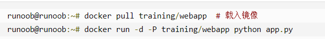
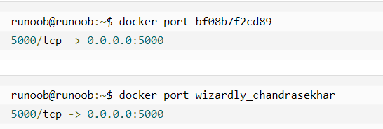
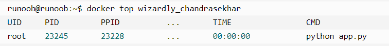
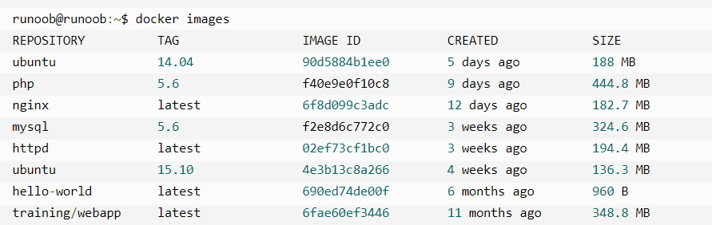

# docker基础

> [认识Docker](https://mubu.com/doc/gtz1UytgR0)

## docker的安装

1. [菜鸟教程](http://www.runoob.com/docker/windows-docker-install.html)

2. [官方](https://hub.docker.com/editions/community/docker-ce-desktop-windows)

3. [CSDN](https://www.cnblogs.com/bjfuouyang/p/3798198.html)

4. [码客下载](https://oomake.com/download/docker-windows)

5. [百度云安装包](https://pan.baidu.com/s/184IOaK5-FRyTEaskLPn_eA?errno=0&errmsg=Auth%20Login%20Sucess&&bduss=&ssnerror=0&traceid=)

## 常用命令

#### docker启动，重启，关闭命令

1. 启动

```bash
systemctl start docker
```

2. 守护进程重启

```bash
systemctl daemon-reload
```

3. 重启docker服务  

```bash
systemctl restart  docker
```

4. 重启docker服务

```bash
service docker restart
```

5. 关闭docker

```bash
service docker stop
```

6. 关闭docker

```bash
systemctl stop docker
```

#### docker命令

1. docker

	查看到 Docker 客户端的所有命令选项

2. docker command --help

	深入的了解指定的 Docker 命令使用方法

*例如查看docker stats指令具体使用方法*

```bash
docker stats --help
```

3. docker run

	创建或运行一个容器

4. docker ps

*查询最后一次创建的容器*

```bash
docker ps -l
```

5. docker pull

	载入镜像
	
	

6. docker start 

	启动WEB应用容器

7. docker logs

	查看容器内标准输出

8. docker stop

	停止容器

9. docker restart

	重启web应用容器

10. docker rm

	移除web应用容器

> 注：删除容器时，容器必须是停止状态

11. docker port

	指定(ID 或者名字)容器的某个确定端口映射到主机的端口号

例如：



12. docker top

	查看容器内部运行的进程

	

13. docker inspect 

	查看 Docker 的底层信息

> 注：它会返回一个 JSON 文件记录着 Docker 容器的配置和状态信息

14. docker images

	列出本地主机上的镜像

	

*参数说明*

|参数|说明|
|:---:|:---:|
|REPOSITORY: TAG|表示镜像的仓库源，定义不同的镜像|
|TAG|镜像的标签|
|IMAGE ID|镜像ID|
|CREATED|镜像创建时间|
|SIZE|镜像大小|

15. docker search

	寻找适合的镜像

*例如*

```bash
docker search httpd
```

*寻找适合的httpd的镜像*


*参数说明*

|参数|说明|
|:---:|:---:|
|NAME|镜像仓库源的名称|
|DESCRIPTION|镜像的描述|
|OFFICIAL|是否docker官方发布|

16. docker tag

	为镜像添加一个新的标签

> 下一步：[docker的使用](知识笔记/工具/虚拟机/docker/docker的使用.md)
