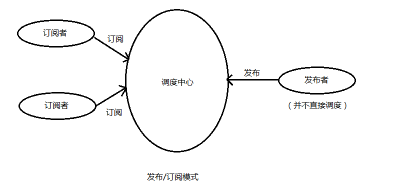

# 发布订阅模式

## 概述

	通过中间调度中心实现广播通知

	订阅者把自己想订阅的事件注册到调度中心， 当该事件触发时候， 发布者发布该事件到调度中心（ 顺带上下文）， 由调度中心统一调度订阅者注册到调度中心的处理代码。



#### 实现方式

**实现代码**

```js
var pubSub = {};
(function(q) {
    var topics = {},
        subUid = -1;
    //发布广播事件
    q.publish = function(topic, args) {
        if (!topics[topic]) {
            return false;
        }
        var subscribers = topics[topic],
            length = subscribers.length;
        while (length--) {
            subscribers[length].func(args);
        }
    }
    //通过特定的名称和回到函数订阅事件
    q.subscribe = function(topic, func) {
        if (!topics[topic]) {
            topics[topic] = [];
        }
        var token = (++subUid).toString();
        topics[topic].push({
            token: token,
            func: func
        })
        return token;
    }
    //通过特定的引用取消订阅
    q.unsubscribe = function(token) {
        for (var m in topics) {
            var item = topics[m]
            if (item) {
                for (var i = 0, length = item.length; i < length; ++i) {
                    if (item[i].token === token) {
                        item.splice(i, 1);
                        return token;
                    }
                }
            }
        }
        return this;
    }
})(pubSub)
var sub1 = pubSub.subscribe('reader', function(content) {
    console.log('小明订阅购买' + content)
})
var sub2 = pubSub.subscribe('reader', function(content) {
    console.log('小红订阅购买' + content)
})
var sub3 = pubSub.subscribe('daily', function(content) {
    console.log('小红订阅购买' + content)
})
pubSub.publish('reader', '读者')
pubSub.unsubscribe(sub1);
pubSub.publish('reader', '读者')
pubSub.publish('daily', '日报')
```

## 使用

