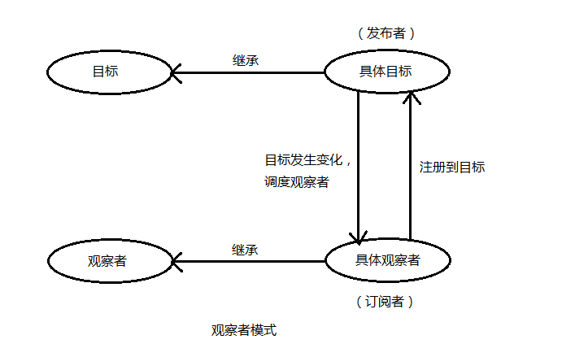

# 观察者模式

## 概述

	定义了一种对象之间的一对多关系， 以便一个对象的状态发生变化时， 所有依赖于它的对象都得到通知并自动刷新。

	

	让多个观察者对象同时监听某一个主题对象

	一个目标对象维持一系列依赖于它（ 观察者） 的对象， 将有关状态的任何更新自动通知给他们。

#### 使用观察者模式的好处

1. 支持简单的广播通信， 自动通知所有已经订阅过的对象（场景）

2. 页面载入后目标对象很容易与观察者存在一种动态关联， 增加了灵活性

3. 目标对象与观察者之间的抽象耦合关系能够单独扩展以及重用

#### 实现方式

* 观察者模式有很多实现方式， 从根本上说， 该模式必须包含两个角色

	观察者、 目标

* 目标和观察者是基类

	目标提供维护观察者的一系列方法
	观察者提供更新接口

* 具体观察者和具体目标继承各自的基类， 然后具体观察者把自己注册到具体目标里， 在具体目标发生变化时候， 调度观察者的更新方法



**实现代码**

```js
if (!Array.prototype.forEach) {
    Array.prototype.forEach = function(fn, thisObj) {
        var scope = thisObj || window;
        for (var i = 0, j = this.length; i < j; ++i) {
            fn.call(scope, this[i], i, this);
        }
    };
}
if (!Array.prototype.filter) {
    Array.prototype.filter = function(fn, thisObj) {
        var scope = thisObj || window;
        var a = [];
        for (var i = 0, j = this.length; i < j; ++i) {
            if (!fn.call(scope, this[i], i, this)) {
                continue;
            }
            a.push(this[i]);
        }
        return a;
    };
}
//扩展函数扩展对象
function extend(obj, extension) {
    for (var key in obj) {
        extension[key] = obj[key]
    }
}
//观察者目标
function ObserverSubject() {
    this.observerList = [];
}
ObserverSubject.prototype.addObserver = function(observer) {
    this.observerList.push(observer)
};
ObserverSubject.prototype.removeObserver = function(observer) {
    this.observerList = this.observerList.filter(function(el) {
        return el !== observer
    });
}
ObserverSubject.prototype.notify = function(context) {
    this.observerList.forEach(function(el, index) {
        el.update(context)
    });
}
//观察者对象
function Observer() {
    this.update = function(content) {}
}
var observerSubjectIns = {};
extend(new ObserverSubject(), observerSubjectIns)
var ob1 = new Observer();
ob1.update = function(content) {
    console.log('ob1 收到通知：' + content)
}
var ob2 = new Observer();
ob2.update = function(content) {
    console.log('ob2 收到通知：' + content)
}
observerSubjectIns.addObserver(ob1);
observerSubjectIns.addObserver(ob2);
observerSubjectIns.notify('吃饭');
observerSubjectIns.removeObserver(ob2);
observerSubjectIns.notify('吃饭');
```

## 使用

#### 使用场景

1. 当一个对象的改变需要同时改变其它对象， 并且它不知道具体有多少对象需要改变的时候， 考虑使用观察者模式

> JS通过回调（Callback）实现观察者模式
