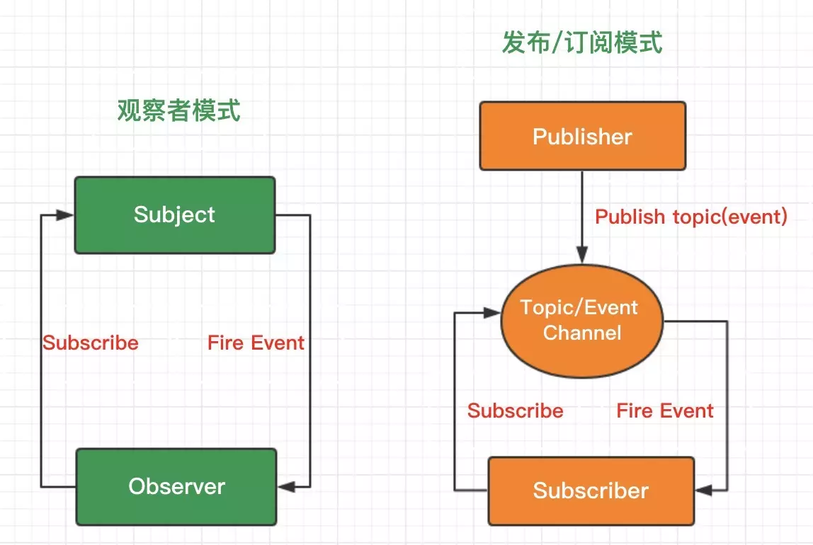

# 观察者模式跟发布订阅模式就是不一样

> [发布订阅模式](知识笔记/思想/设计模式/发布订阅模式/发布订阅模式.md) | [观察者模式](知识笔记/思想/设计模式/观察者模式/观察者模式.md)

## 观察者模式与发布/订阅模式的区别

**宏观原理图了解**



#### 对观察者模式的理解

	一个对象（ 称为subject） 维持一系列依赖于它的对象（ 称为observer）， 将有关状态的任何变更自动通知给它们（ 观察者）

#### 对发布/订阅模式的理解

	基于一个主题 / 事件通道， 希望接收通知的对象（ 称为subscriber） 通过自定义事件订阅主题， 被激活事件的对象（ 称为publisher） 通过发布主题事件的方式被通知

#### 两种模式之间的差异

* `Observer模式` (观察者模式)要求观察者必须订阅内容改变的事件， 定义了一个一对多的依赖关系； 

* `Publish/Subscribe模式` (发布/订阅模式)使用了一个主题/事件通道， 这个通道介于订阅着与发布者之间； 

* 观察者模式里面观察者「被迫」执行内容改变事件（subject内容事件）； 发布/订阅模式中， 订阅着可以自定义事件处理程序； 

* 观察者模式两个对象之间有很强的依赖关系； 发布/订阅模式两个对象之间的耦合很低。 

## 示例对比

#### 观察者模式的应用

```js
// 以下为半伪代码

// 定义下观察者
function Observer() {
    this.update = function() {}
}

// 定一个下目标
function Subscribe() {}

// 添加观察者
Subscribe.prototype.addObserver = function(observer) {}

// 目标通知变更
Subscribe.prototype.notify = function() {}

let subscribe = new Subscribe();

// 定义一个佩奇猪的观察者
let paigeObs = new Observer();
paigeObs.update = function(what) {
    console.log("12 o'clock! 佩奇猪想要" + what);
}
subscribe.addObserver(paigeObs);

// 定义一个皮卡丘的观察者
let pokemonObserver = new Observer();
pokemonObserver.update = function(what) {
    console.log("皮卡丘还可以做一点自己比较个性的事情，但是12点我也是要去吃饭的！");
    console.log("12 o'clock! 皮卡丘想要" + what);
}
subscribe.addObserver(pokemonObserver);

// 假装12点到了
subscribe.notify('去吃饭啦～'); // 它们都去吃饭了

// or
subscribe.notify('继续玩耍～'); // 它们还在一起玩耍
```

**分析**

> 可以看出， 每一个 `observer` 虽然也可以自定义自己的处理程序（ `update方法` ）， 但是观察者模式下， 观察者们都是做 `同一类的事情` 。 

#### 发布/订阅模式的应用

```js
// 以下为半伪代码

// 简易的发布订阅
let pokemonSubscribe = {
    subscribe: function() {},

    publish: function() {}
}

// 佩奇猪：我要订阅一个「12点」的主题事件，提醒我继续工作
pokemonSubscribe.subscribe("12 o'clock", function() {
    console.log '佩奇猪要继续工作！这就是为什么本猪上了屏幕，而我们上了餐桌。')
});

// 皮卡丘：我也要订阅一个「12点」的主题事件，提醒我去吃饭
pokemonSubscribe.subscribe("12 o'clock", function() {
    console.log('皮卡丘要吃饭，去它的工作！')
});

// 假装12点到了
pokemonSubscribe.publish("12 o'clock");
```

**分析**

> 如我们所见， 发布/订阅模式， 订阅的是订阅者各自 `不同逻辑的处理程序` ， 类比下jQuery订阅点击事件

## 从实现方式上理解差异

	从实现方式上看两者的不同

#### 实现观察者模式

```js
/**
 * 观察者模式组件
 */
define(function(require, exports, module) {

    function ObserverList() {
        this.observerLists = [];
    }

    // 添加观察者对象
    ObserverList.prototype.add = function(obj) {

            // 保证observer的唯一性
            if (this.observerLists.indexOf(obj) != -1) return this.observerLists;
            return this.observerLists.push(obj);
        },

        // 清空观察者对象
        ObserverList.prototype.empty = function() {
            this.observerLists = [];
        },

        // 计算当前的观察者数量
        ObserverList.prototype.count = function() {
            return this.observerLists.length;
        },

        // 取出对应编号的观察者对象
        ObserverList.prototype.get = function(index) {
            if (index > -1 && index < this.observerLists.length) {
                return this.observerLists[index];
            }
        },

        // 指定位置上插入观察者对象
        ObserverList.prototype.insert = function(obj, index) {
            let pointer = -1;

            if (index === 0) {
                this.observerLists.unshift(obj);
                pointer = index;
            } else if (index === this.observerLists.length) {
                this.observerLists.push(obj);
                pointer = index;
            } else {
                this.observerLists.splice(index, 0, obj);
                pointer = index;
            }

            return pointer;
        },

        // 查找观察者对象所在的位置编号
        ObserverList.prototype.indexOf = function(obj, startIndex) {
            let i = startIndex || 0,
                pointer = -1;

            while (i < this.observerLists.length) {
                if (this.observerLists[i] === obj) {
                    pointer = i;
                    break;
                }
                i++;
            }

            return pointer;
        },

        // 移除指定编号的观察者
        ObserverList.prototype.removeIndexAt = function(index) {
            let temp = null;
            if (index === 0) {
                temp = this.observerLists.shift();
            } else if (index === this.observerLists.length) {
                temp = this.observerLists.pop();
            } else {
                temp = this.observerLists.splice(index, 1)[0];
            }

            return temp;
        }

    // 定义目标类
    function Subject() {
        this.observers = new ObserverList();
    }

    // 添加观察者
    Subject.prototype.addObserver = function(observer) {
        this.observers.add(observer);
    }

    // 移除观察者
    Subject.prototype.removeObserver = function(observer) {
        this.observers.removeIndexAt(this.observers.indexOf(observer, 0));
    }

    // 通知观察者
    Subject.prototype.notify = function(params) {
        let observersCount = this.observers.count();

        for (let i = 0; i < observersCount; i++) {
            this.observers.get(i).update(params);
        }
    }

    function Observer() {

        // 定义观察者内容更新事件
        this.update = function() {}
    }

    module.exports = {
        Observer: Observer,
        Subject: Subject,

        // 对象扩展
        extend: function(obj, extension) {
            for (let key in obj) {
                extension[key] = obj[key];
            }
        }
    };
});
```

#### 实现发布/订阅模式

```js
/**
 * 发布/订阅模式组件
 */

// 定义发布/订阅类
class pokemonSubscribe {
    constructor() {
        this.topics = {};
        this.subUid = -1;
    }

    // 发布事件
    publish(topic, args) {
        if (!this.topics[topic]) return false;

        let subscribers = this.topics[topic];
        let len = subscribers ? subscribers.length : 0;

        while (len--) {
            subscribers[len].func(topic, args);
        }

        return this;
    }

    // 订阅事件
    subscribe(topic, func) {
        if (!this.topics[topic]) this.topics[topic] = [];

        let token = (++this.subUid).toString();
        this.topics[topic].push({
            token: token,
            func: func
        })

        return token;
    }

    // 取消订阅
    unsubscribe(token) {
        for (let m in topics) {
            if (topics[m]) {
                for (let i = 0; i < topics[m].length; i++) {
                    if (topics[m][i].token == token) {
                        topics[m].splice(i, 1);
                        return token;
                    }
                }
            }
        }
        return this;
    }
}

export default pokemonSubscribe;
```

> 参考： [_安歌-不好意思， 观察者模式跟发布订阅模式就是不一样](https://juejin.im/post/5af05d406fb9a07a9e4d2799)

