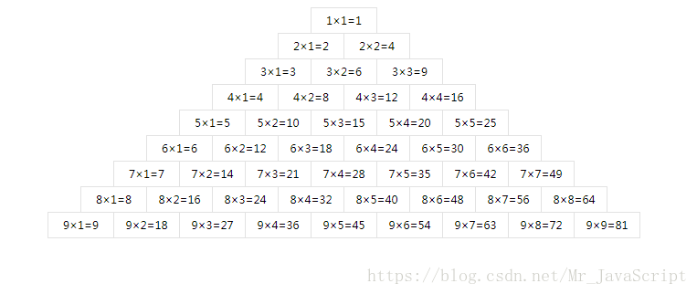

# js实现9*9乘法表

## 题目

	这是一个9*9的乘法口诀表，是完全用算法生成的，下来请用javascript完成生成一个这样的乘法口诀表，要求和图片一模一样，注意边框，注意字体，注意一切细节，不允许使用table

> 

## 解题思路

1. 第一步：9*9乘法行输出肯定是通过双层循环递减

2. 重要的居住问题可以通过div center解决

3. 强调的边框问题通过 border + margin 解决

4. 细节问题：字体，应该是宋体，可以慢慢调

## 实现代码

> [9*9乘法表实现](练习手册/大前端/算法计划/2020年/1月/20200105-第一天/index.html)

> 参考：https://blog.csdn.net/Mr_JavaScript/article/details/79769572
