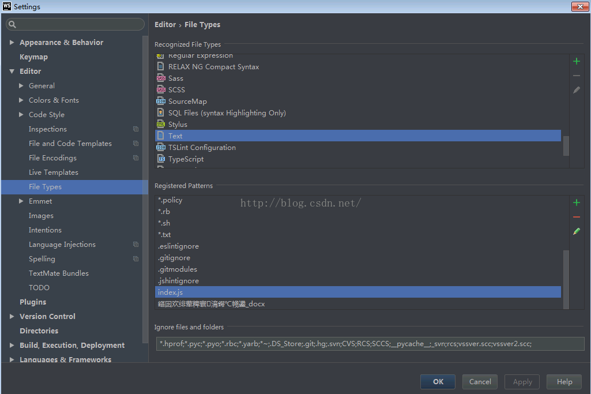

# IntelliJ问题

> IntelliJ有很多工具，前端常用开发工具有IDEA和WebStorm

## 常见问题

#### 内存问题

	IntelliJ产品因为功能强大，干的事太多，所以很吃内存，一般我们都需要更改给IntelliJ的内存供给，不然很容易卡死
	而且如果intellij内存不足，会频繁的访问电脑硬盘，造成性能瓶颈。

> 这里就WebStorm来说(其他产品类同)

* 修改内存

找到WebStorm的安装位置，在根目录下的bin文件夹中找到配置文件webstorm.exe.vmoptions，右键编辑器打开

	32位就修改webstorm.exe.vmoptions
	64位就修改webstorm64.exe.vmoptions
	> 不清楚的就全改了

|参数|参数描述|
|:---:|:---:|
|-Xms512m|设置IDEA初时的内存大小，提高Java程序的启动速度|
|-Xmx2048m|设置IDEA最大内存数，提高该值，可以减少内存Garage收集的频率，提高程序性能|  
|-XX:ReservedCodeCacheSize=480m|保留代码占用的内存容量|

> 这样是常规开发配置，如果个人配置很牛逼可以考虑给更多内存，一般这样就够了。

## 快捷操作

#### 快捷操作

	代码提示快捷操作

###### WebStorm自定义代码模板

	这里可以可以自定义代码模版，即设置代码提示快捷生成完整功能模版代码

> 位置：setting --> Editor --> Live Templates

1. `fori`

```bash
for($VARKIND$ $INDEX$ = 0; $INDEX$ < $LIMIT$; $INDEX$++) {
  $END$
}
```

2. `log`

```bash
console.log($msg$);
$end$
```

> 注：要设置使用的文件类型，例如：JavaScript、vue，设置方式：在配置的时候下发会有个提示：define，点击选择允许使用的文件类型

#### 快捷键


## 文件设置问题

#### 文件类型识别错误

1. index.js文件被识别为text文件

	这样就会导致文件语法提示等很多功能失效，总之是个要解决的问题，体验不好

*原因*

	txt类型识别了以当前js文件名命名的模式
	简单理解就是手贱误操作

*解决办法*

	File—setting—Editor—FileTypes找到Text类型
	将其中的index.js格式从中取消，apply



> 同理，如果其他类型的文件被误添加到别的文件识别中了也可以通过这样移除
