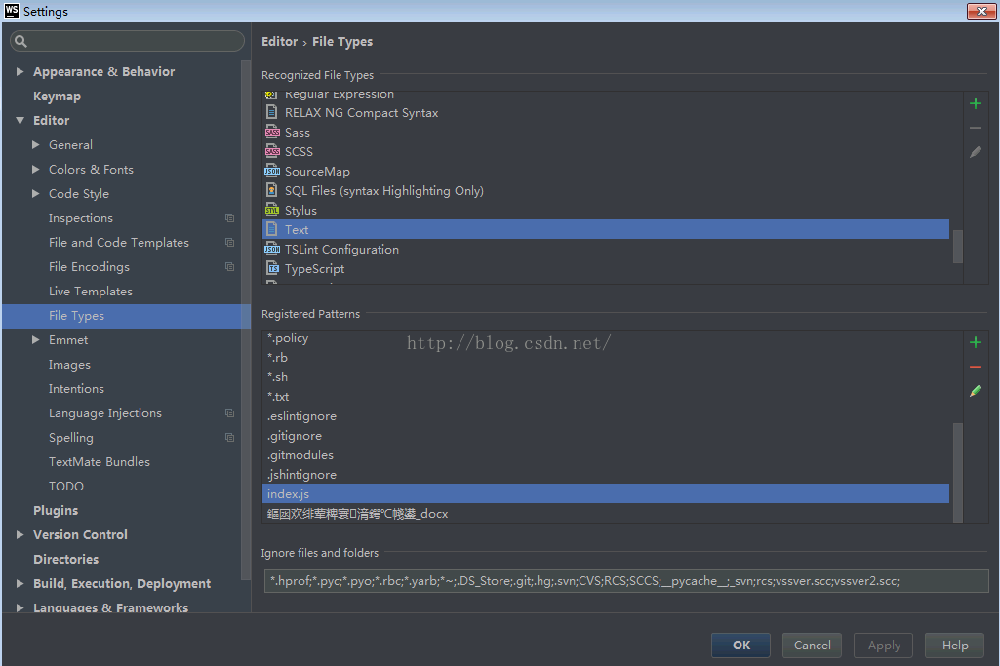

# WebStorm设置问题

## 文件设置问题

#### 文件类型识别错误

1. index.js文件被识别为text文件

	这样就会导致文件语法提示等很多功能失效，总之是个要解决的问题，体验不好

*原因*

	txt类型识别了以当前js文件名命名的模式
	简单理解就是手贱误操作

*解决办法*

	File—setting—Editor—FileTypes找到Text类型
	将其中的index.js格式从中取消，apply



> 同理，如果其他类型的文件被误添加到别的文件识别中了也可以通过这样移除

## 快捷操作

#### 快捷操作

	代码提示快捷操作

###### WebStorm自定义代码模板

	这里可以可以自定义代码模版，即设置代码提示快捷生成完整功能模版代码

> 位置：setting --> Editor --> Live Templates

1. `fori`

```bash
for($VARKIND$ $INDEX$ = 0; $INDEX$ < $LIMIT$; $INDEX$++) {
  $END$
}
```

2. `log`

```bash
console.log($msg$);
$end$
```

> 注：要设置使用的文件类型，例如：JavaScript、vue，设置方式：在配置的时候下发会有个提示：define，点击选择允许使用的文件类型

#### 快捷键
